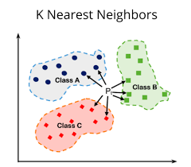

# KNN algorithm

Website demo: https://knn-algorithm-pbhg5sumywziybtjbpzibw.streamlit.app/



<!-- TABLE OF CONTENTS -->
<details>
  <summary>Table of Contents</summary>
  <ol>
    <li>
      <a href="#about-the-project">About The Project</a>
      <ul>
        <li><a href="#built-with">Built With</a></li>
      </ul>
    </li>
    <li>
      <a href="#getting-started">Getting Started</a>
      <ul>
        <li><a href="#prerequisites">Prerequisites</a></li>
        <li><a href="#installation">Installation</a></li>
      </ul>
    </li>
    <li><a href="#usage">Usage</a></li>
    <li><a href="#roadmap">Roadmap</a></li>
    <li><a href="#contributing">Contributing</a></li>
    <li><a href="#license">License</a></li>
    <li><a href="#contact">Contact</a></li>
    <li><a href="#acknowledgments">Acknowledgments</a></li>
  </ol>
</details>
<!-- ABOUT THE PROJECT -->

<!-- ABOUT THE PROJECT -->

## About The Project

Dự án này nhằm mục tiêu tìm hiểu và áp dụng thuật toán K-Nearest Neighbors (KNN) thông qua việc sử dụng các tập dữ liệu
mẫu có sẵn trong thư viện scikit-learn. Cụ thể, chúng tôi sẽ sử dụng các dataset sau:

- load_diabetes
- load_digits
- load_iris
- load_breast_cancer
- load_linnerud
- load_wine

Trong quá trình thực hiện, chúng ta sẽ luyện tập kỹ năng vẽ biểu đồ để trực quan hóa dữ liệu và kết quả phân loại của
thuật toán.

<p align="right">(<a href="#readme-top">back to top</a>)</p>

### Được xây dựng trên

#### Ngôn ngữ: Python

#### Thư viện:

- streamlit
- scikit
- pandas
- numpy
- plotly
- streamlit_option_menu

<p align="right">(<a href="#readme-top">back to top</a>)</p>

## Getting Started

Đây là một ví dụ về cách bạn có thể cung cấp hướng dẫn về việc thiết lập dự án tại máy của bạn.
Để có được một bản sao cục bộ và chạy, hãy làm theo các bước ví dụ đơn giản này.

### Installation

1. Clone the repo:
   ```sh
   git clone https://github.com/khoapdaio/KNN-algorithm.git
   ```
2. Open folder project:
   ```sh
   cd KNN-algorithm
   ```
3. Create a virtual environment(if needed)
   ```sh
   virtualenv venv
   ```
4. Activate the virtual environment
    -  On Windows:
    ```bash
    venv\Scripts\activate
    ```
    - On macOS/Linux:
    ```bash
    source venv/bin/activate
    ```
    - For the streamlit environment:
    ```bash
    pip freeze > requirements.txt
    ```
5. Install the necessary libraries:
   ```bash
   pip install -r requirements.txt
   ```
<p align="right">(<a href="#readme-top">back to top</a>)</p>


<!-- USAGE EXAMPLES -->

## Usage

1. Chạy câu lệnh(Run command):
   ```bash
   streamlit run src/app.py
   ```
2. Tùy chỉnh các tham số và mô hình theo nhu cầu của bạn (Customize parameters and models according to your needs). 

3. Theo dõi các kết quả dự đoán và điều chỉnh mô hình để cải thiện hiệu suất (Monitor prediction results and adjust the model to improve performance).

<p align="right">(<a href="#readme-top">back to top</a>)</p>


<!-- ROADMAP -->

## Cấu trúc dự án(Directory Structure)

- `static/`: Lưu trữ dữ liệu tĩnh.
- `static/image/`: Lưu trữ ảnh của dự án (Stores project images)
- `src/model/`: Chứa các file model  .
- `src//`: Chứa các file model  .
- `src/view/`: Chứa các file chức năng hiển thị.
- `src/app.py`: File app khởi chạy dự án
- `Report/`: Lưu trữ thông tin báo cáo chi tiết.

<p align="right">(<a href="#readme-top">back to top</a>)</p>


<!-- LICENSE -->

## License

Distributed under the MIT License. See `LICENSE.txt` for more information.

<p align="right">(<a href="#readme-top">back to top</a>)</p>


<!-- CONTACT -->

## Contact

Phạm Đăng Khoa - khoa.phamdangaio97@gmail.com

Project Link: [https://github.com/khoapdaio/KNN-algorithm](https://github.com/khoapdaio/KNN-algorithm)

<p align="right">(<a href="#readme-top">back to top</a>)</p>
